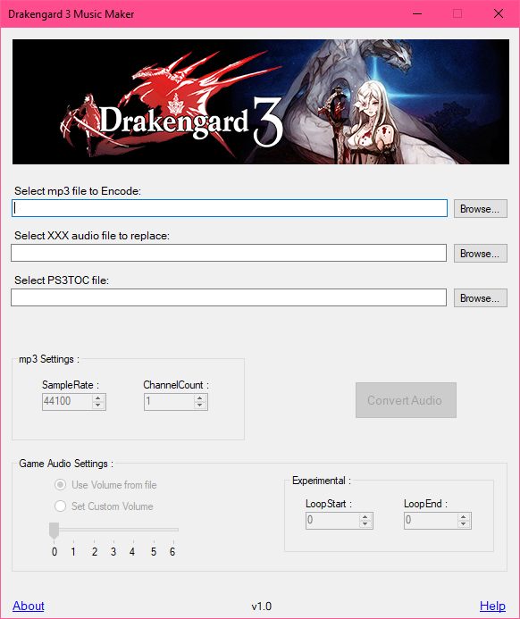

# Drakengard 3 Music Maker
 
  
 This is a small C# Winforms based GUI app, that allows you to change any of the ingame music tracks from Drakengard 3. custom music encoded with this app was tested heavily with the game running off of the RPCS3 emulator and this may or may not work on a actual PS3 console. instructions to use this app can be accessed from the Help option on the app.
  **Important Note:** The loop start and end values will require you to input the exact byte position from where you want the audio to continue playing after it has finished playing once. an simple way to loop your audio continously would be to just enter the size of the mp3 audio file in the loop end value and that should ensure that the audio track repeats after it has finished played the first time.
  The following versions of the game were tested:
 **BLUS31197** - US Blu-Ray Disc version (also with 1.01 update installed)
 **NPUB31251** - US PSN version (also with 1.01 update installed)
 **NPEB01407** - EU PSN version (only with the 1.01 update installed)
 
## For developers
The following additional packages were used for Big Endian reading and writing byte values:
 **System.Memory** - https://www.nuget.org/packages/System.Memory/
 **System.Buffers** - https://www.nuget.org/packages/System.Buffers/
  These packages were used for embedding all generated dlls into a single executable:
 **Fody** - https://www.nuget.org/packages/Fody
 **Costura.Fody** - https://www.nuget.org/packages/Costura.Fody/
